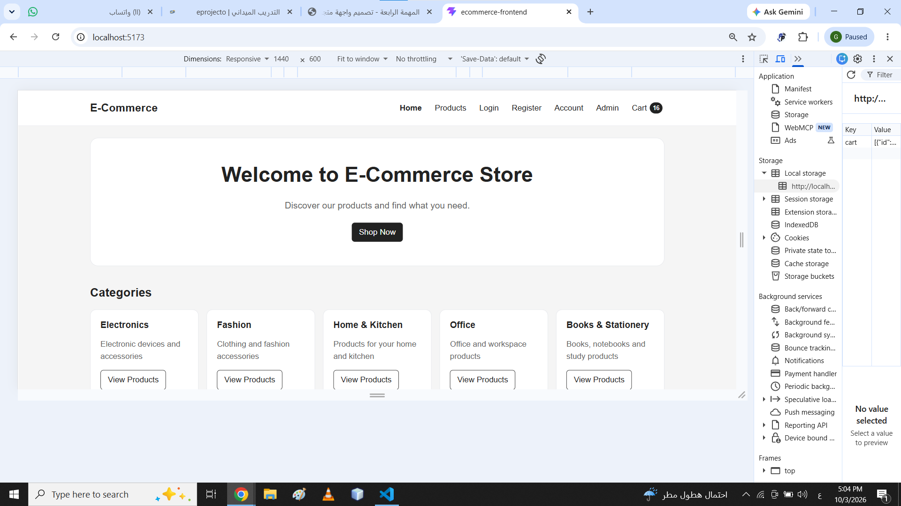
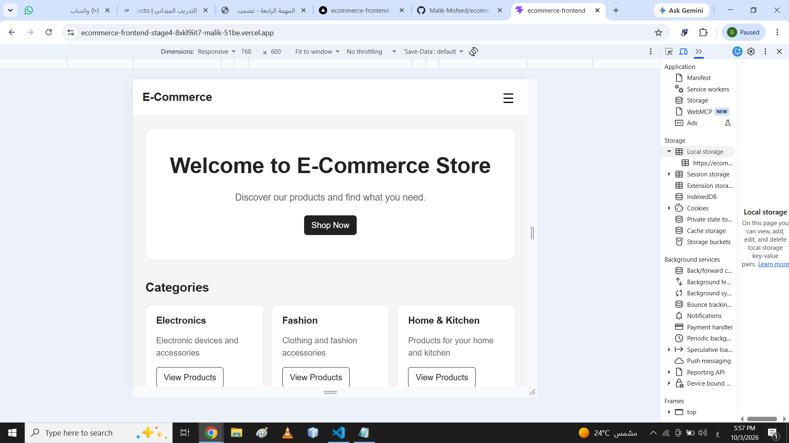
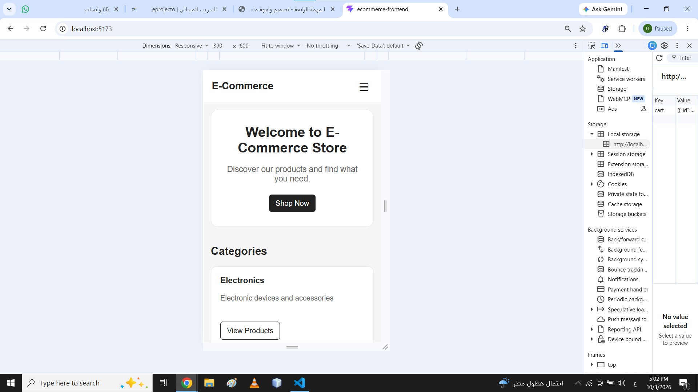

# E-Commerce Frontend

A responsive e-commerce frontend built with React and Vite.

## Project Description

This project is a frontend implementation of an e-commerce store using React and Vite.

The application currently uses static mock data. The frontend is **not connected to the backend API or Neon database in this stage**, as required by the project specification.

## Technologies Used

* React
* Vite
* React Router
* JavaScript
* CSS
* Local Storage

## Project Structure

```text
src/
├── assets/
├── components/
│   ├── common/
│   ├── layout/
│   └── products/
├── context/
├── data/
├── hooks/
├── pages/
├── styles/
└── utils/
```

## Main Pages

The application includes:

* Home
* Products
* Product Details
* Login
* Register
* Cart
* Checkout
* User Profile
* Admin Dashboard
* Unauthorized
* 404 Not Found

## Reusable Components

The project uses reusable React components such as:

* Navbar
* Footer
* ProductCard
* CategoryCard
* SearchBar
* Button
* Input
* Modal
* Loader
* Alert
* EmptyState
* AdminSidebar

## Features

### Products

* Display products using mock data
* Search products by name
* Filter products by category
* Sort products by name or price
* Product details page
* Out-of-stock state

### Shopping Cart

* Add products to cart
* Change product quantity
* Remove products
* Calculate cart total
* Prevent quantity from exceeding available stock
* Save cart data in Local Storage
* Empty cart state

### Forms

Initial validation is implemented for:

* Login
* Registration
* Checkout
* Admin product creation

### UI States

The application includes:

* Loading
* Error
* Empty State
* Success Message
* No Search Results
* Empty Cart
* Product Out of Stock
* Unauthorized
* 404 Not Found

## Responsive Design

The interface is designed to work across:

* Desktop: 1440px
* Tablet: 768px
* Mobile: 390px

The layout is designed to avoid unintended horizontal scrolling.

## Mock Data

The application uses static data for development and testing, including:

* Products
* Categories
* Orders
* Demo User
* Demo Admin

## Admin Dashboard

The admin dashboard provides a basic interface for:

* Viewing product statistics
* Adding products
* Viewing products
* Viewing recent orders

The admin functionality is currently frontend-only and does not communicate with the backend API.

## Backend Integration

Backend and Neon database integration are intentionally not implemented in this stage.

API integration will be completed in the following project stage.

## Running the Project

Install dependencies:

```bash
npm install
```

Start the development server:

```bash
npm run dev
```

Then open the local URL shown by Vite in the terminal.

## Project Status

This project represents the frontend stage of the e-commerce application and is prepared for the next stage, where the frontend will be connected to the existing REST API.

## Demo Accounts

The project includes local demo accounts for testing the customer and admin roles.

- Customer account: see `src/data/users.js`
- Admin account: see `src/data/users.js`

No real passwords or secrets are included in the project.

## Screenshots

### Desktop - 1440px



### Tablet - 768px



### Mobile - 390px



## Live Preview

https://ecommerce-frontend-stage4-8xkl9iit7-malik-51be.vercel.app

## Test Results

Manual test results are documented in:

`RESULTS_TEST_TASK.md`